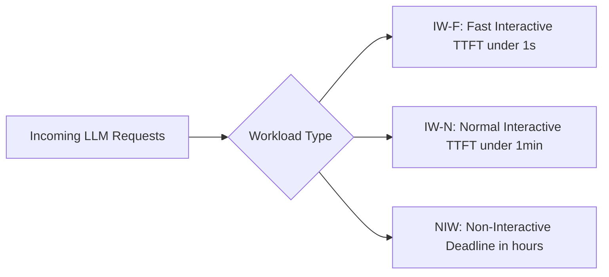
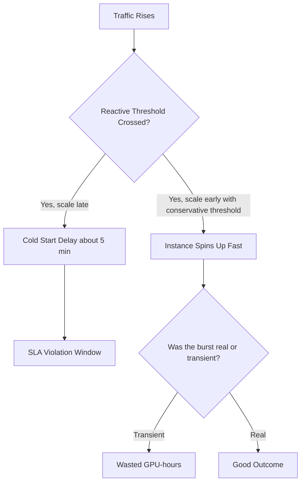
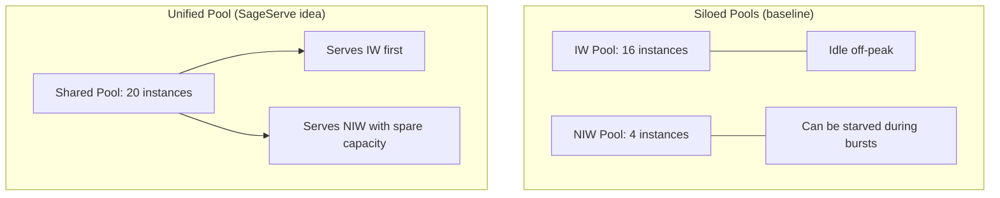
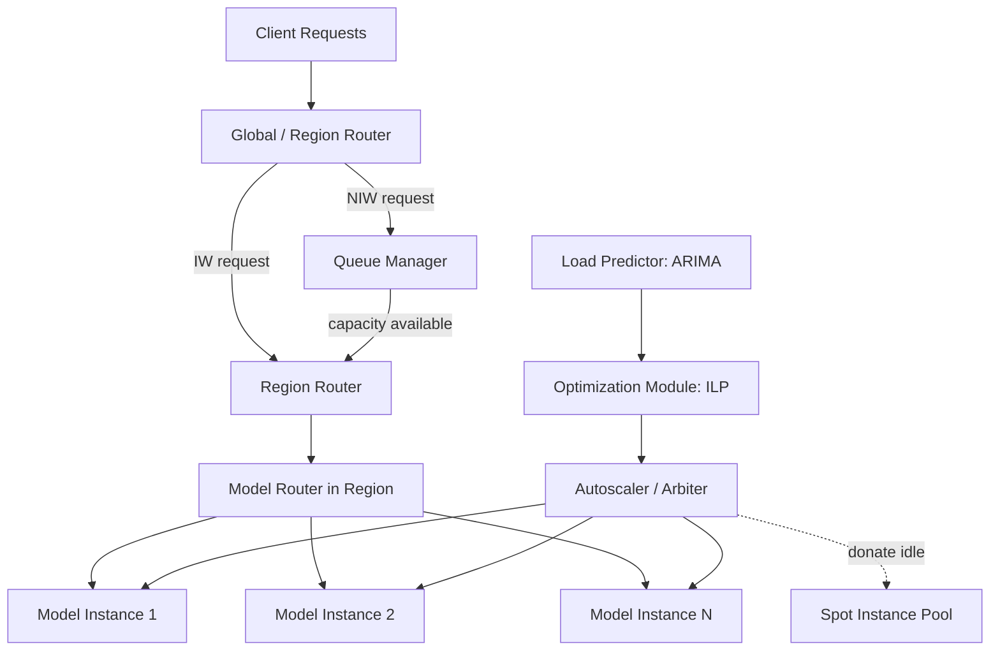
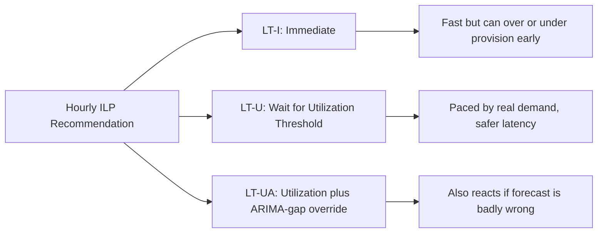

# SageServe: Optimizing LLM Serving on Cloud Data Centers with Forecast Aware Auto-Scaling

**Authors:** Shashwat Jaiswal, Kunal Jain, Yogesh Simmhan, Anjaly Parayil, Ankur Mallick, Rujia Wang, Renee St. Amant, Chetan Bansal, Victor Ruhle, Anoop Kulkarni, Steve Kofsky, Saravan Rajmohan
**Code/data:** https://github.com/shashwatj07/SageServe

---

## 1. The Problem in Plain Terms

Large cloud providers (Microsoft, Google, OpenAI, AWS) run massive fleets of GPU virtual machines to serve LLM inference requests. These requests are not all alike:

- Some need an answer in under a second (a chatbot reply).
- Some can tolerate a minute (a "normal" interactive request).
- Some can wait hours (nightly document summarization, batch report generation).

The paper calls the first two categories **Interactive Workloads (IW)**, split into **IW-F** (fast, <1s Time-to-First-Token) and **IW-N** (normal, <1 min), and the third category **Non-Interactive Workloads (NIW)**, which have relaxed, deadline-based SLAs (e.g., complete within 24 hours).

The core operational problem: how many GPU instances of each LLM model should be running, in each data center region, at each point in time, so that:

1. Latency-sensitive requests meet their SLA, and
2. Expensive GPU capacity isn't sitting idle or being over-provisioned "just in case."

This is hard because:

- LLM instances are slow to spin up (minutes to hours, since model weights can be tens to hundreds of GB).
- Traffic is bursty and varies by time of day, day of week, region, and model.
- Existing practice keeps **separate GPU pools** for IW and NIW, which wastes capacity: the IW pool sits underused off-peak while the NIW pool might be starved during bursts.

> [!NOTE]
> The central tension in this paper is speed versus efficiency. React fast enough to avoid violating SLAs, but don't react so eagerly that GPUs are provisioned and then left idle.

## 2. Motivating Example (Figure 1)

The paper illustrates the tension with a scaling example: a model instance can serve 4000 tokens-per-second (TPS).

- **Reactive scaling** (react only when load crosses a threshold) causes an instance to be requested at T=15 min, but because cold-starting a new instance takes about 5 minutes, it isn't ready until T=20 min. During that gap, the system is under-provisioned and violates SLAs.
- If you instead configure a more conservative (lower) capacity threshold to scale up earlier, you avoid the SLA violation but now **over-provision**: a small, temporary traffic bump at T=25 min triggers a scale-up that turns out to be unnecessary once traffic stabilizes, wasting GPU-hours.

This is the fundamental trade-off the paper is trying to solve: reactive auto-scaling based on real-time metrics alone is either too slow (causing violations) or too jumpy (causing waste), because it doesn't know what's coming next.

## 3. Contribution 1: Characterizing Real Production Workloads

Before proposing a fix, the authors characterize **real, Internet-scale LLM inference traffic** from Microsoft Office 365 (via Copilot), which handles more than 10 million requests/day across US data centers. They use two trace snapshots, November 2024 and July 2025, to see how things evolved.

Key empirical findings:

- **IW-F dominates volume.** IW-F and IW-N together make up 72% of all requests; IW-F alone is the largest single share.
- **Strong, predictable periodicity for IW.** IW-F shows a clean diurnal (daily) pattern with quiet weekends, a periodicity score of 0.7 to 0.95 for the largest model. IW-N is also periodic but less strongly so (0.3 to 0.8). This means simple time-series forecasting (like ARIMA) can reasonably predict IW load ahead of time.
- **NIW is unpredictable but low and stable.** NIW traffic has near-zero periodicity (score 0 to 0.286), but its overall level is fairly steady through the week, meaning it doesn't need to be forecast precisely; it just needs a strategy to "fit in" opportunistically.
- **Regional imbalance.** The same model can have wildly different demand across US East, US Central, and US West (e.g., one model sees 4x more load in East than West). Since requests can be routed to any US region, this reflects load-balancing/capacity-allocation choices, not necessarily where users physically are.
- **Traffic has grown roughly 5x in seven months**, driven by new use cases like RAG (Retrieval-Augmented Generation), which alone accounts for 41.2% of requests, plus content generation, workflows, chat, and evaluation frameworks.
- **Latency variance differs sharply by tier.** NIW has by far the highest variance in latency (the variance ratio of NIW : IW-F : IW-N is roughly 150 : 1 : 0.5), consistent with NIW's relaxed SLA.
- **Load is uneven even within a region.** Looking at percentile load across model instances within one region, some regions (e.g., East US) show much more divergence between P50 and P99 load than others, indicating inefficient internal load balancing across instances of the same model.

> [!TIP]
> Takeaway used later in the paper: IW is predictable enough to forecast and pre-provision for. NIW is unpredictable but tolerant, so it should be opportunistically squeezed into leftover capacity rather than driving its own dedicated pool.

## 4. Contribution 2: Why Siloed GPU Pools Are Wasteful

The current (baseline) production design keeps **separate instance pools** for IW and NIW per model per region, each with its own greedy reactive scaling rule (scale out if memory utilization > 70%, scale in if < 30%).

The paper runs a controlled comparison: siloed pools (e.g., 16 instances for IW plus 4 for NIW per model per region) versus a **unified pool** (all 20 instances shared dynamically between IW and NIW, with NIW only using spare capacity when utilization is low, e.g., below 50 to 60%).

Result (using a one-day trace replayed through their simulator, four open-source models: Bloom-176B, Llama2-70B, Llama3.1-8B, Llama3.2-3B):

- The **unified pool uses 34.5% fewer instance-hours** than the siloed approach for the same workload, because idle IW capacity can be reused for NIW instead of sitting empty or being separately maintained.
- Crucially, this consolidation does **not** meaningfully hurt IW latency SLAs: P95 Time-to-First-Token changes by at most about 12% (and is nearly identical for the Llama models).
- The unified approach also frees up more instance-hours (52 hours in this experiment) to donate to Azure's spot instance market, generating additional value from otherwise idle GPUs.

> [!WARNING]
> Pure reactive scaling on a unified pool is still not enough on its own. It's still vulnerable to the same over/under-provisioning problem from Figure 1 because it doesn't anticipate future load; it only reacts to what's already happening. This motivates the next piece: predictive, forecast-aware scaling.

## 5. Contribution 3: The Optimization Problem

The paper formalizes the scaling/routing decision as a constrained optimization problem, solved every hour with an **Integer Linear Program (ILP)**.

**Setup:** Given the current number of VM instances of each model type in each region, and a forecast of expected token throughput (TPS) demand per model per region for the next hour, decide how many instances to add or remove (an integer, per model/region/GPU-type combination).

**Constraints:**

- Each model in each region must be able to serve at least a chosen fraction of its own forecasted peak load locally in real time (excess demand beyond that fraction can be rerouted to other regions).
- Across all regions combined, total capacity for a model must be able to cover the total forecasted demand for that model (with inter-region rerouting allowed).
- You can't remove more instances than currently exist.

**Objective:** Minimize the *wasted overhead* of scaling. This has two cost components:

1. **VM acquisition cost:** the cost of spinning up new virtual machines.
2. **Model deployment/loading cost:** the cost of loading model weights onto a VM, proportional to how many instances of a model are newly created.

Both of these costs represent GPU time that is "wasted" because the VM/instance isn't usable while it's initializing. The ILP finds the cheapest set of instance changes that still satisfies the SLA constraints.

> [!NOTE]
> Practicality check from the paper: the ILP solves in about 1.4 seconds for their base configuration (4 models, 3 regions, 1 GPU type) and about 33 seconds when scaled up to 20 models/regions and 5 GPU types. Both are fast enough for hourly re-optimization.

**Forecasting model:** They use **ARIMA** time-series forecasting on per-region, per-model TPS, comparing it against three alternatives (Moving Average, Time-Varying Autoregressive/TVAR, Hidden Markov Models). ARIMA is chosen because it's fast to train and accurate enough, whereas TVAR/HMM are somewhat more accurate but much slower to train, and Moving Average is fast but inaccurate. A safety buffer (10% of the past hour's NIW load) is added on top of the forecast to absorb transient bursts and leave headroom for NIW.

## 6. The SageServe Architecture

SageServe is the overall system built around these ideas. Its main components (mapped onto the existing Microsoft O365 serving stack) are:

- **Global Router / Region Router:** Routes incoming IW requests to whichever region has memory utilization below a threshold (e.g., 70%), preferring nearby regions first. NIW requests instead go to a **Queue Manager**.
- **Queue Manager (for NIW):** Holds NIW requests and releases them to a region/model endpoint only when that endpoint signals spare capacity (utilization below 60%, or below 50% triggers releasing two requests at once). NIW requests have a 24-hour default deadline; requests older than 10 hours get bumped to the same priority as IW requests to avoid starvation.
- **Model Router (within a region):** Sends requests to whichever instance of a model has the shortest remaining queue ("Join the Shortest Queue").
- **Local instance scheduler:** Batches requests using one of four ordering policies (see Section 8 below): FCFS, EDF, PF, or the paper's own DPA policy.
- **Load Predictor + Optimization Module:** Runs ARIMA forecasting and the ILP hourly to compute the target instance count per model per region.
- **Autoscaler ("Arbiter"):** Executes the ILP's recommended changes. Rather than blindly following the hourly recommendation, it offers three strategies for *when* to actually scale (see Section 7).
- **Spot instance layer:** Idle capacity (internal or freed by consolidation) can be leased out as preemptible spot instances to other Azure customers, and reclaimed quickly (median about 1 minute) when internal demand rises again.

## 7. Three Scaling Strategies Compared

Given an hourly ILP recommendation, when should the system actually act on it? The paper tests three approaches:

1. **LT-I (Immediate):** Scale to the recommended count right away, every hour. Simple, but can cause premature over-provisioning (scaling for a peak that hasn't arrived yet) and can hurt latency when scaling down too aggressively before the hour's real trough occurs.
2. **LT-U (Deferred, Utilization-based):** Only scale out when actual memory utilization crosses 70%, and only scale in when it drops below 30%, capping the total change at what the ILP recommended. This paces the change to match real, observed demand rather than a forecast alone.
3. **LT-UA (Deferred, Utilization + ARIMA-gap aware):** Like LT-U, but during the last 20 minutes of each hour, if observed traffic is diverging sharply from the ARIMA forecast (5x higher or 0.5x lower), it overrides the utilization-based cap and keeps scaling in the needed direction. This makes the system more robust to forecast errors and sudden bursts.

## 8. Four Request Scheduling Policies (within an instance)

To fairly balance IW-F and IW-N when they share the same instance queue, the paper evaluates:

- **FCFS (First Come First Serve):** Ignore SLA tier, just serve in arrival order. Used as the baseline; it doesn't distinguish tiers, so it under-serves the stricter IW-F tier relative to its needs.
- **EDF (Earliest Deadline First):** Order by how close a request is to its latency deadline. Naturally favors IW-F since its deadline is tighter.
- **PF (Priority First):** Always serve every IW-F request before touching any IW-N request. Maximizes IW-F service but can severely starve IW-N.
- **DPA (Deadline and Priority Aware):** The paper's own tunable policy. It buckets requests into four categories (severely expired, recently expired, urgent-and-approaching-deadline, non-urgent) and serves them in a defined priority order that balances the tiers rather than favoring one absolutely.

Empirically (Section 7.2.6), naive equal treatment gives IW-F a much higher SLA violation rate (about 45%) than IW-N (about 25%) simply because IW-F's deadline is stricter and gets crowded out. EDF balances violations more evenly (31% IW-F / 34% IW-N). PF minimizes IW-F violations (24%) but pushes IW-N violations up to 60%. DPA lands in between (28% / 38%) and can be tuned toward either tier.

## 9. Evaluation Setup

Because experimenting with real GPU fleets is expensive, the authors built a simulation harness by extending **Splitwise**, an existing open-source LLM-serving simulator. They validated its accuracy against real hardware (R² of 0.99 for prefill/prompt-phase timing, 0.83 for decode-phase timing; overall prediction MAPE under 3%).

- **Models used:** Four open-source LLMs standing in for the proprietary GPT-family models used internally: Bloom-176B, Llama2-70B, Llama3.1-8B, Llama3.2-3B (plus, in a later scalability test, Llama-4 Scout, a 109B-parameter Mixture-of-Experts model).
- **Hardware:** 8x NVIDIA A100 or H100 GPUs per instance, depending on the experiment.
- **Workload:** Real O365 request traces (July 2025 primary, November 2024 for validation), spanning three US regions and a week of traffic (about 10 million requests total across the study).
- **Baselines compared against:**
  - **Reactive**: the current unified-pool heuristic (scale at 70%/30% utilization thresholds), representing today's production-like behavior.
  - **Chiron**: a prior state-of-the-art academic auto-scaler that the authors reimplemented, which relies on offline performance profiles rather than online memory metrics.

## 10. Headline Results

- **GPU-hour savings:** SageServe's forecast-aware strategies (LT-I, LT-U, LT-UA) use **19.65% to 24.21% fewer instance-hours** than pure reactive scaling for a single day/model, because they don't chase every momentary traffic blip.
- **Cost translation:** At roughly \$98.32/hour for an H100 cluster (Azure pricing at time of writing), saving about 85 instance-hours/day for one model in one region extrapolates to about **\$0.6 million/week**, or **up to \$2.5 million/month**, across their evaluated setting (3 models, 4 regions, 7 days).
- **No SLA sacrifice:** LT-U and LT-UA maintain latency SLAs while achieving these savings; LT-I alone is slightly worse for TTFT/E2E latency because of its immediate-scale-down behavior.
- **Comparison with Chiron:** Chiron consistently deploys far more instances (its curve sits well above all of SageServe's strategies and even above plain Reactive scaling) without a corresponding tail-latency benefit, because it scales based on static offline profiles rather than live utilization signals.
- **Wasted scale-up cycles cut by about 70%:** Because cold starts are expensive, unnecessary scale-up/scale-down churn wastes GPU-hours even when it doesn't cause SLA violations. SageServe's forecast-aware pacing avoids much of this churn.
- **Generalizes to a newer, larger MoE model:** Adding Llama-4 Scout (109B parameters, Mixture-of-Experts) confirms the approach's benefits hold even for structurally different, larger models.
- **Robust to bursts:** In a synthetic 8x traffic-burst test, LT-UA recovers (drops memory utilization back down) faster than LT-I or LT-U, showing its ARIMA-gap override logic helps it adapt when forecasts are wrong.
- **Holds over a full week and across the older (Nov 2024) trace too:** the same 25% instance-hour reduction pattern reappears, suggesting the approach isn't overfit to one trace snapshot.
- **Robust across hardware and IW:NIW ratios (ablation study):** On A100 clusters (slower to load models than H100), LT-UA still saves 28.2% GPU-hours over Reactive. Changing the IW:NIW request ratio from the observed 3:1 to 9:1 or 1:1 still yields meaningful savings (26.3% and 22% respectively), since the buffer sizing logic adapts to NIW volume.

## 11. How This Differs From Prior Work

The paper positions itself against three lines of related work:

1. **General cloud VM autoscaling** (e.g., Google's Autopilot, Microsoft's Protean): well studied for CPU workloads, but LLM serving is different because of high latency sensitivity, large and slow-to-load model weights, and the split between compute-bound "prefill" and memory-bound "decode" phases of inference.
2. **Single-region or single-instance LLM serving optimizations** (e.g., load balancing across identical instances, thermal-aware scheduling, faster model loading via extra storage): these typically assume equal-priority workloads or focus on a single region, missing the cross-region and cross-tier imbalances SageServe targets.
3. **Prior heterogeneous-workload autoscalers**, notably **Chiron**: closest in spirit (also mixes interactive and batch LLM workloads) but uses backpressure-based, largely reactive/offline-profile-driven scaling rather than forecast-driven proactive scaling, and doesn't address inter-region imbalances.

SageServe's distinguishing claims: it is grounded in a large-scale, multi-region, multi-tier production trace that it also open-sources; it unifies IW/NIW into shared pools instead of siloing them; and it combines short-term reactive load balancing with longer-term forecast-driven, ILP-optimized capacity planning across regions simultaneously.

## 12. Limitations and Honest Caveats (stated by the authors)

> [!IMPORTANT]
> These are the caveats worth keeping in mind before treating the paper's numbers as universal.

- The evaluation uses **open-source stand-in models** (Bloom, Llama family) because the real production GPT-family models are proprietary; absolute numbers could differ with the real models.
- **Theoretical/benchmarked performance limits don't always match real-world achieved performance.** The authors explicitly flag this as a lesson learned, implying some of the TPS/capacity numbers used in planning are approximations.
- The scheduling and SLA-tiering approach is demonstrated for two IW sub-tiers (fast/normal); extending to a fuller continuum of SLA levels is left as future work.
- Testing across genuinely heterogeneous hardware fleets (mixing GPU generations within the same deployment, rather than assuming homogeneous hardware per experiment) is also flagged as future work.
- Cost savings figures are extrapolations based on current Azure list pricing and the specific trace/region/model combinations tested; they are illustrative projections, not audited production financials.

## 13. Bottom-Line Summary

SageServe argues that the standard practice of keeping separate, reactively-scaled GPU pools for fast and slow LLM workloads wastes a large amount of expensive accelerator capacity. By characterizing real production traffic to show that fast interactive workloads are actually quite predictable, pooling interactive and batch workloads together so idle capacity can be shared, and using a lightweight, hourly ARIMA-plus-ILP forecast to decide capacity ahead of time (paced by real-time utilization signals rather than followed blindly), the system claims roughly a quarter reduction in GPU-hours and an 80% cut in wasted scaling churn, without violating latency SLAs, translating to a projected multi-million-dollar monthly saving at the scale Microsoft O365 operates.

---