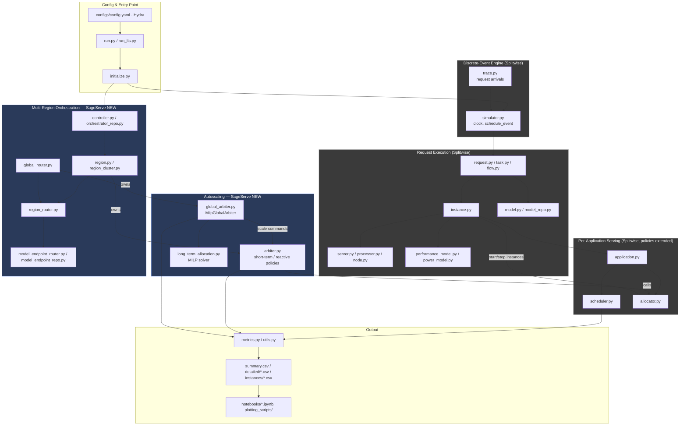
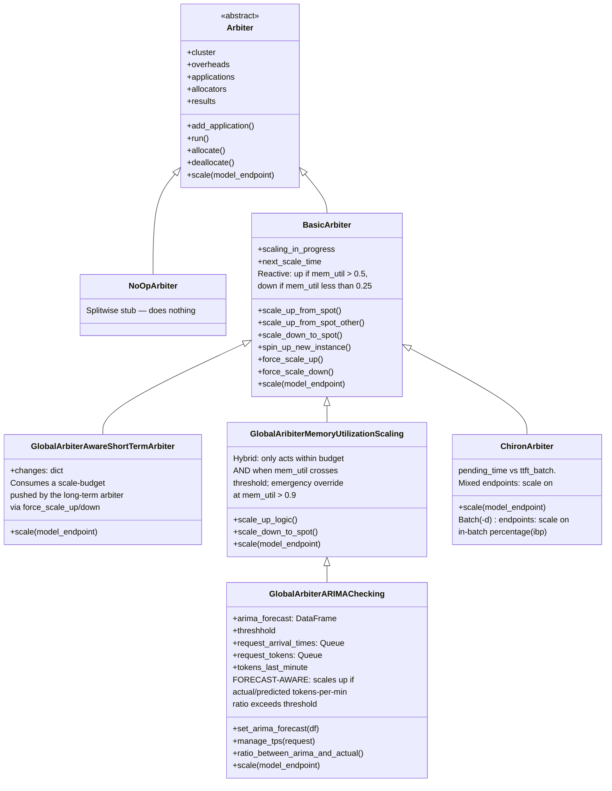
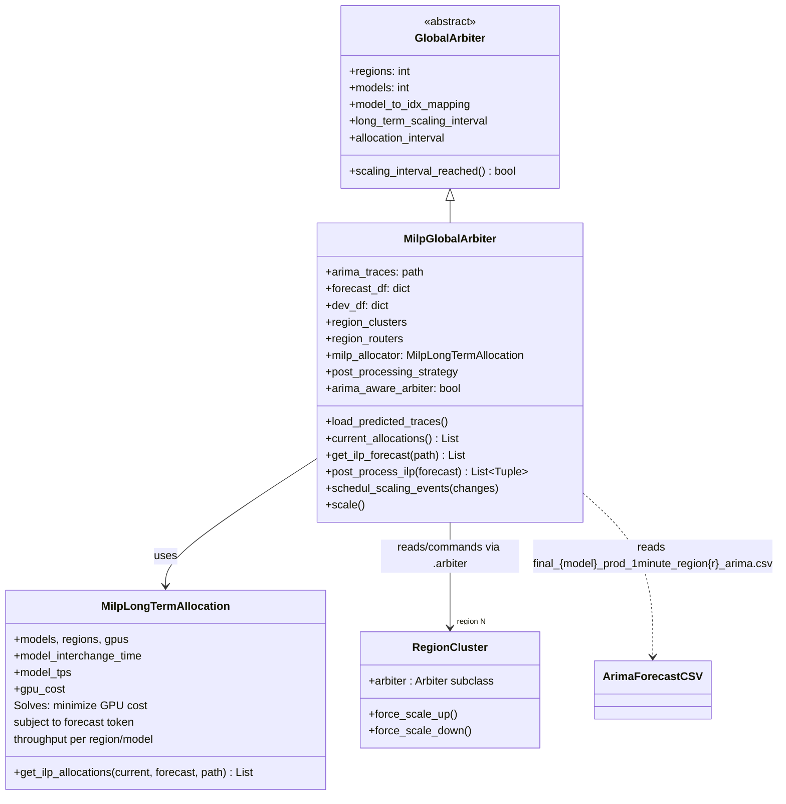
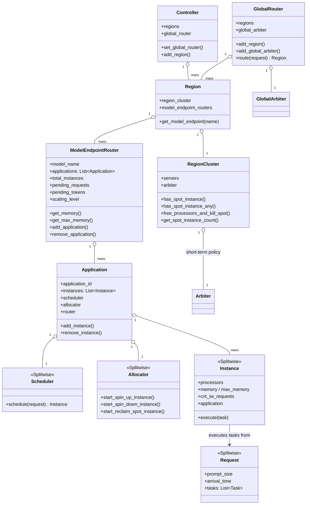
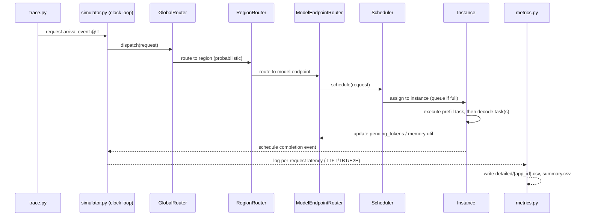
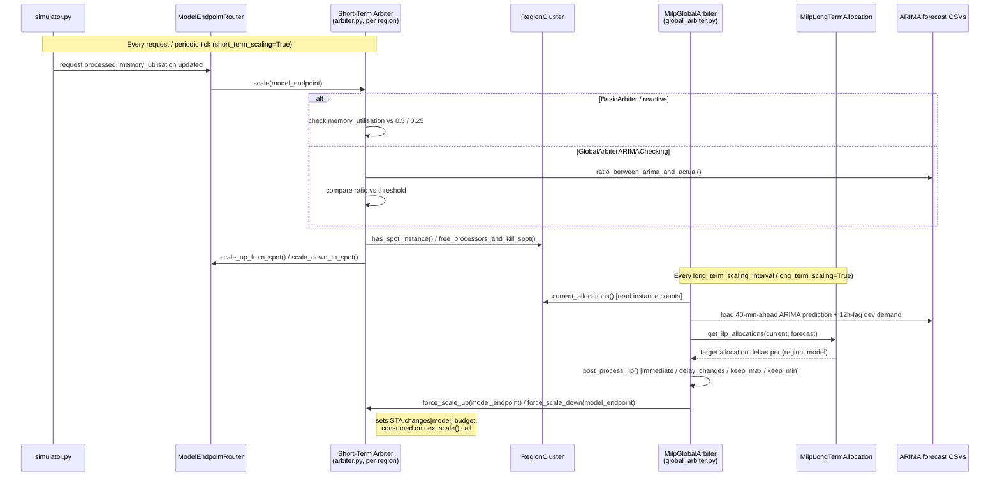
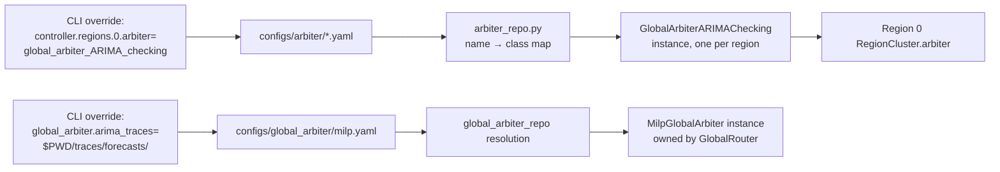

# SageServe — Architecture & UML Reference

## 0. What comes from Splitwise vs. what SageServe adds

SageServe is a **fork** of the [Splitwise simulator](https://github.com/Mutinifni/splitwise-sim). The relationship is not "inspired by" — large parts of the low-level discrete-event engine, request/instance model, and prefill/decode disaggregation logic are **reused code**. SageServe's contribution sits almost entirely in the **autoscaling / multi-region orchestration layer**.

| Layer | Origin | Files |
| --- | --- | --- |
| Discrete-event engine (`clock()`, `schedule_event`) | **Splitwise** (unchanged core) | `simulator.py` |
| Request → Task decomposition, prefill/decode split | **Splitwise** | `request.py`, `task.py`, `flow.py` |
| Instance execution, batching, KV-cache/memory tracking | **Splitwise** | `instance.py`, `server.py`, `processor.py` |
| Analytical performance/power model | **Splitwise** (extended) | `performance_model.py`, `power_model.py` |
| Single-application scheduler (request → instance) | **Splitwise** (baseline), policies extended | `scheduler.py`, `allocator.py` |
| Hydra config-driven object instantiation | **Splitwise** pattern, config trees extended | `initialize.py`, `configs/` |
| **Per-model, per-region reactive arbiters** (memory-utilization scaling, spot-instance reclaim, ARIMA-checked scaling, Chiron-style scaling) | **SageServe (new)** | `arbiter.py` |
| **Global, cross-region, cross-model long-term allocator** (MILP + ARIMA forecast ingestion) | **SageServe (new)** | `global_arbiter.py`, `long_term_allocation.py` |
| **Multi-region topology** (region clusters, region-level routers, cross-region controller) | **SageServe (new)** — Splitwise is single-cluster | `region.py`, `region_cluster.py`, `region_router.py`, `global_router.py`, `controller.py` |
| Forecast-aware vs. reactive scaling experiments, production-trace evaluation | **SageServe (new)** — this is the paper's contribution | `run.py`, `run_lts.py`, `configs/global_arbiter/*` |

**In one sentence:** Splitwise supplies the *simulated GPU cluster that correctly executes LLM requests*; SageServe wraps that engine in *N regions × M models*, and replaces Splitwise's "no-op" router/arbiter stubs with real reactive and forecast-aware autoscaling policies, plus a MILP-based long-term capacity planner, so the paper can compare instance-hours and latency under different scaling strategies on production-like traces.

---

## 1. Module dependency diagram

Blue boxes = SageServe additions. Grey boxes = inherited Splitwise machinery (some lightly extended, e.g. `scheduler.py` policies).

---

## 2. Class UML — Arbiter hierarchy (the reactive scaling policies, `arbiter.py`)

**Reading this diagram:** every concrete class overrides `scale()`, which is called periodically per `model_endpoint` by the simulator. `BasicArbiter` is pure local reactive logic (Splitwise-style, but implemented for SageServe's spot/shared-pool scaling model). Everything below `GlobalArbiterAwareShortTermArbiter` in the tree is **forecast-aware**, in that it defers to (or blends with) a `changes` budget pushed down by the global long-term arbiter — `GlobalArbiterARIMAChecking` is the one that additionally does its **own** short-horizon forecast comparison every request.

---

## 3. Class UML — Global (long-term) arbiter and MILP allocator

`MilpGlobalArbiter.scale()` is the **forecast-aware long-term loop**: every `long_term_scaling_interval` seconds it reads current allocation + ARIMA forecast → MILP → converts the delta into `force_scale_up`/`force_scale_down` calls on each region's arbiter (from Diagram 2). Note the `post_processing_strategy` knob (`immediate`, `delay_changes`, `keep_maximum_instances`, `keep_minimum_instances`) — this is where a lot of the paper's "how aggressively to trust the forecast" experimentation lives.

---

## 4. Class UML — Core serving objects (mostly Splitwise-inherited)

---

## 5. Sequence diagram — request lifecycle (Splitwise mechanics, SageServe entry point)

This part is essentially unmodified Splitwise — SageServe's changes don't touch how one request executes, only how many instances exist to receive it.

---

## 6. Sequence diagram — where SageServe's scaling logic actually fires

This is the crux of the "reactive vs. forecast-aware" comparison: with `long_term_scaling=False`, only the top block runs (pure reactive, memory-utilization-triggered or ARIMA-ratio-triggered per request). With `long_term_scaling=True`, the bottom MILP loop also runs on a slower cadence and constrains/guides what the short-term arbiter is allowed to do.

---

## 7. Config → class resolution (Hydra wiring)

To add your own extension (new scheduling policy or forecasting model), you add a class to `arbiter.py` (or a new forecast source consumed in `global_arbiter.py`), register it in `arbiter_repo.py`, add a matching `configs/arbiter/<name>.yaml`, and select it the same way via CLI override — no changes needed to `run.py` or the engine.