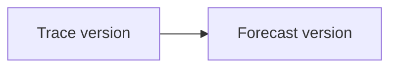
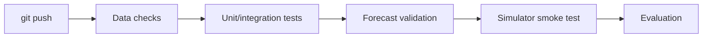
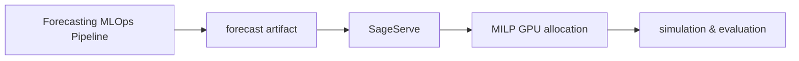
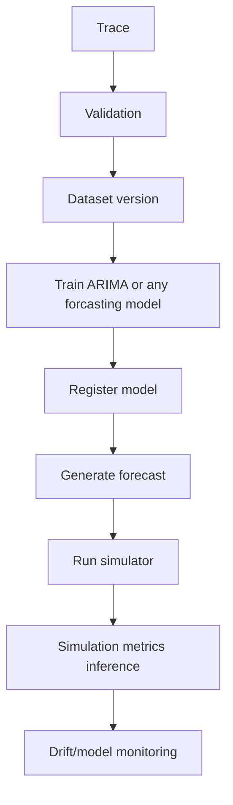

# SageServe : MLOps Integration Plan

## Potential Project Idea

SageServe remains a **simulation-based evaluation framework for forecast-aware autoscaling**.

>[!NOTE]
> We will add an **MLOps pipeline around the workload data anddemand-forecasting model**, rather than treating the simulator itself as an ML system.


------------------------------------------------------------------------

## MLOps Components to Implement

### Configuration Management

-   Make the pipeline configuration-driven.
-   Use YAML/Hydra configuration for:
    -   trace selection
    -   forecasting model
    -   forecast horizon/frequency
    -   simulator settings
    -   evaluation settings

### ETL + Data Validation

Build a preprocessing pipeline:


Validate:
- required columns
- timestamps
- missing values
- duplicate
- records
- negative/invalid workload values
- valid model/region IDs

### Versioning + Lineage

Version:
- raw traces
- processed forecasting datasets (generated)
forecasts
- experiment/simulation runs

Maintain lineage:



A lightweight Git/DVC-based implementation is sufficient.

### Model Registry + Governance

Treat the demand forecaster as the ML model.

Initially use the existing **ARIMA forecasting approach**.

Register:
- forcast model version
- training dataset version
- parameters (MAE/RMSE/MAPE)
- training timestamp
- validation status

The selected model version produces the forecast consumed by SageServe.

### Containerization

Containerize the complete reproducible workflow:

``` text
+ Data preprocessing
+ Forecasting
+ SageServe
+ Evaluation
```

The simulator does not need to become a production service.

### CI/CD + Testing

Create a GitHub Actions pipeline that automatically checks:

-   data/schema validation
-   preprocessing
-   forecasting output
-   model sanity checks
-   SageServe simulator smoke test
-   metric generation

Example:



### Observability + Drift Monitoring

Monitor:

**Data drift** :
- request rate
- token/request distribution
- model distribution
- regional distribution
- workload type

**Model performance** :
- predicted vs actual demand
- MAE/RMSE/MAPE

If drift or forecast error exceeds a configured threshold:


------------------------------------------------------------------------

## SageServe's Role

We will **not modify SageServe into an ML system**.

Instead:



The simulator is the **downstream evaluation environment** for different forecasting model versions.

This allows us to answer:

>[!QUESTION]
>Does a new forecasting model not only improve prediction accuracy, but also improve the resulting autoscaling decisions and system-level metrics?

------------------------------------------------------------------------

## Final Demonstration

The final demo should show one complete run:



Then compare **at least two model versions/configurations** through the same SageServe simulation and show both:

1.  forecasting metrics, and
2.  downstream simulation/autoscaling metrics.

The goal is to demonstrate that MLOps manages the **entire lifecycle of the forecasting component**, while SageServe evaluates its effect on the simulated serving system.

---

<!-- # Potential Research Extension: Dynamic SLA Inference for LLM Serving

### Problem

SageServe assumes that each workload is already classified into discrete SLA tiers:

* **IW-F** — Interactive-Fast
* **IW-N** — Interactive-Normal
* **NIW** — Non-Interactive

However, in a real LLM serving system, an incoming request will not necessarily arrive with an `IW-F/IW-N/NIW` label.

For example, two requests from the same application could have very different requirements:

```text
"Who is the PM of India?"
        → very low latency requirement

"Summarize these two large PDFs."
        → higher computational demand / potentially relaxed latency
```

The existing system focuses on **scheduling requests after the SLA tier is known**, but does not address the preceding question:

> **How is the appropriate SLA tier determined for an incoming request?**

### Proposed Research Idea

Introduce an **SLA inference layer** before SageServe:

```text
Real LLM Request
       ↓
Request Profiling
       ↓
SLA Inference
       ↓
IW-F / IW-N / NIW
       ↓
SageServe Scheduler
       ↓
GPU Allocation
```

The inference could consider:

* Input/context size
* Expected output length
* Model
* Application/user requirements
* Deadline/priority
* Request modality
* Historical serving behavior

### Further Extension: Continuous SLA

Instead of forcing every request into three discrete classes, we could predict a **continuous service requirement**:

```text
Request → Required latency = 3.7 seconds
```

rather than:

```text
Request → IW-F / IW-N / NIW
```

This could allow the scheduler to make finer-grained resource-allocation decisions.

### Research Questions

1. **Can SLA requirements be inferred automatically for incoming LLM requests?**
2. **Does dynamic SLA inference improve SLO satisfaction and GPU efficiency compared with fixed SLA tiers?**
3. **Can continuous SLA requirements outperform discrete IW-F/IW-N/NIW classifications?**

### Evaluation

Compare:

```text
Static SLA tiers
        vs
Rule-based SLA inference
        vs
ML-based SLA inference
        vs
Continuous SLA
```

using:

* SLO violations
* P95/P99 latency
* TTFT
* GPU-hours
* GPU utilization
* Queueing delay

This would extend SageServe from a **trace-driven system where the workload class is already known** toward a more realistic **request-driven LLM serving system where service requirements must be determined dynamically**. -->
